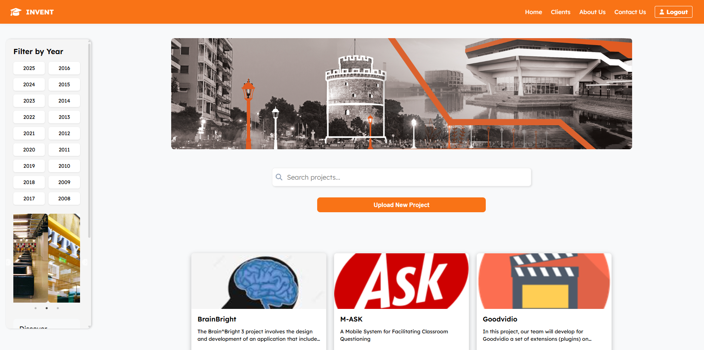
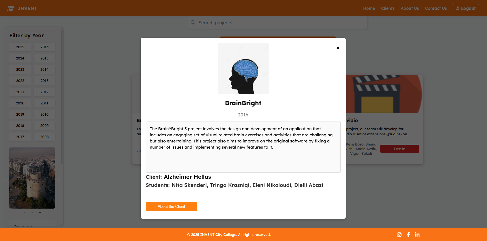
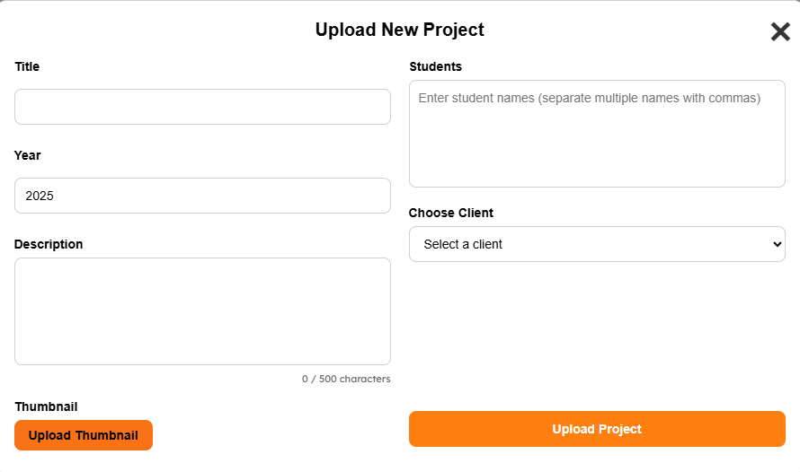
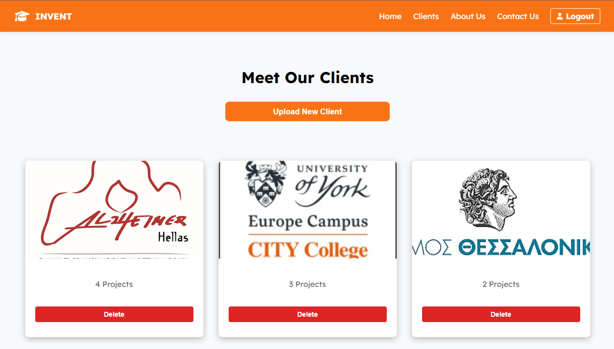
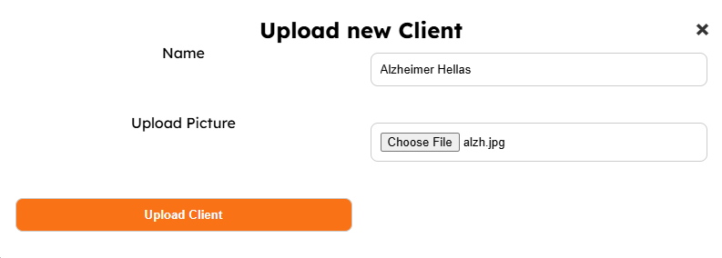
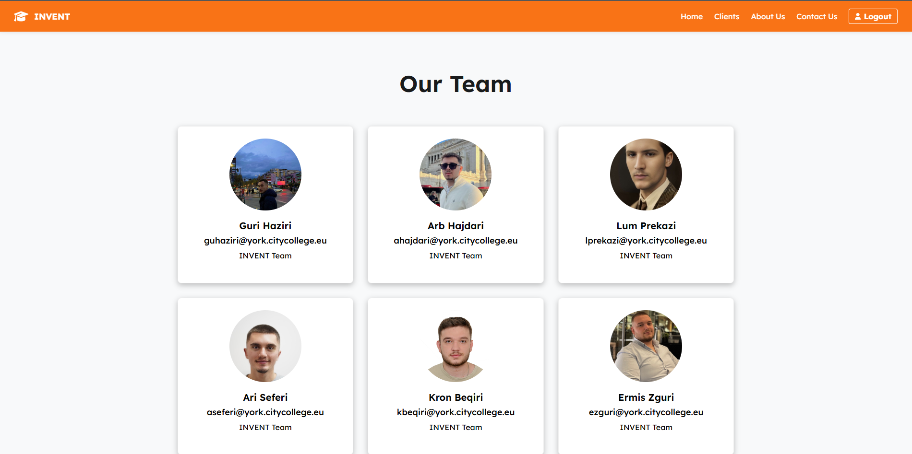

# Industrial Project (INVENT)

A full-stack web application built with Strapi (backend) and React (frontend) to manage clients and their projects. Developed as part of a university industrial project, this system showcases end-to-end integration between content management and a modern user interface.

## Features
- Strapi backend for content and client management
- React frontend with a clean and responsive UI
- Upload and display client information and projects
- Font Awesome integration for modern icons
- Environment-based configuration for flexible deployment

## Tech Stack
Strapi · React · Node.js · SQLite 

## Project Structure
```bash 
.
├── docs/
├── backend/ # Strapi backend (content management & API)
├── frontend/ # React frontend (UI)
├── .gitignore
├── README.md
```

## Requirements
- Node.js 18+
- npm
- SQLite (via Strapi)
- Environment variables (`.env` in backend)

- ## Getting Started
- 1. Clone the Repository
```bash 
git clone https://github.com/arbhajdari/invent-industrial-project.git
cd invent-industrial-project
```
- 2. Backend Setup
```bash 
cd backend
npm install
npm run develop
```
- 3. Frontend Setup
```bash 
cd ../frontend
npm install
npm start
```
- 4. Font Awesome Dependencies
Install the following (if not already included):
```bash 
npm install @fortawesome/free-brands-svg-icons @fortawesome/react-fontawesome @fortawesome/fontawesome-svg-core
```

## Screenshots

### Home Page


### Projects


### Upload New Project


### Clients


### Upload New Client


### Our Team



## License
This project is licensed under the MIT License - see the [LICENSE](LICENSE) file for details.

## Author
Developed by [Arb Hajdari](https://www.linkedin.com/in/arbhajdari)  
Feel free to connect with me!


